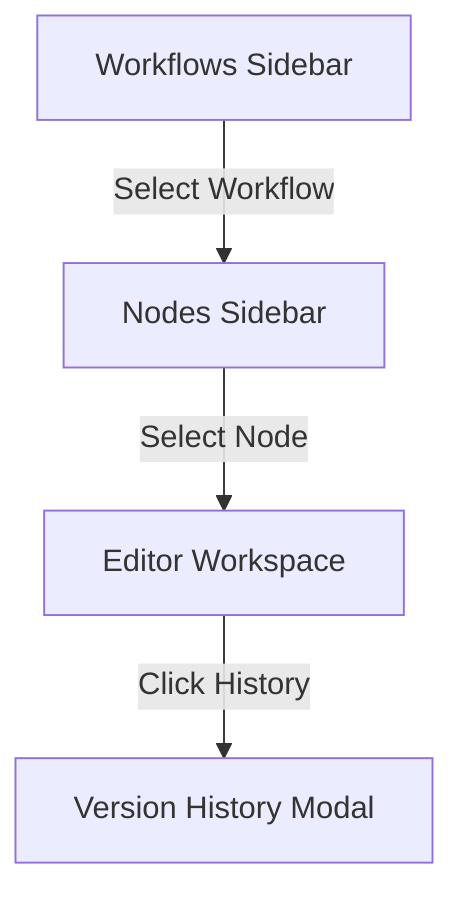

# System Prompts Manager: Database Schema & Usage Guide

The **System Prompts Manager** is a visual admin interface designed for managing, versioning, and deploying LLM system prompts across various workflow automation nodes (specifically integrated with n8n and Postgres/PostgreSQL). It allows administrators to define model settings, manage local vs. remote LLMs, and inspect the changes log history.

---

## 1. Database Schema (`public.system_prompts`)

All system prompts and their versions are stored in the PostgreSQL table `public.system_prompts`. 

### Table Definition
```sql
CREATE TABLE IF NOT EXISTS public.system_prompts (
    id SERIAL PRIMARY KEY,
    workflow_name VARCHAR(255) NOT NULL,
    workflow_view_name VARCHAR(255),
    workflow_id VARCHAR(255),
    node_name VARCHAR(255),
    prompt TEXT,
    model VARCHAR(255),
    local_model VARCHAR(255),
    changes VARCHAR(255),
    created_at TIMESTAMP WITH TIME ZONE DEFAULT CURRENT_TIMESTAMP
);
```

### Column Descriptions

| Column Name | Data Type | Nullable? | Description |
| :--- | :--- | :--- | :--- |
| **`id`** | `SERIAL` | **No** | Unique auto-incrementing identifier for each prompt version. |
| **`workflow_name`** | `VARCHAR(255)` | **No** | The actual system-level identifier of the workflow (e.g., `logistics_analysis`). |
| **`workflow_view_name`** | `VARCHAR(255)` | Yes | The user-friendly display name of the workflow in the UI (e.g., `물류분석`). |
| **`workflow_id`** | `VARCHAR(255)` | Yes | The corresponding workflow ID in n8n (e.g., `dsAmcpSQZgFTJClC`). |
| **`node_name`** | `VARCHAR(255)` | Yes | The name of the specific node using the prompt (e.g., `Generate Analysis Code`). |
| **`prompt`** | `TEXT` | Yes | The actual text of the system prompt. |
| **`model`** | `VARCHAR(255)` | Yes | The OpenRouter remote model identifier (e.g., `google/gemini-2.0-flash`). |
| **`local_model`** | `VARCHAR(255)` | Yes | The Ollama local model identifier (e.g., `llama3:latest`). |
| **`changes`** | `VARCHAR(255)` | Yes | Description of changes made in this version (e.g., `v1.0.1 - 차량번호 감지 정규식 수정`). |
| **`created_at`** | `TIMESTAMP` | Yes | The timestamp when the version was saved (defaults to `NOW()`). |

---

## 2. Key Architecture & Versioning Flow

To prevent accidental data loss and maintain a history of prompt modifications, the application implements **Append-Only Versioning**:

1. **Insert/Update Action (`POST` & `PUT`)**: 
   - Both creating a prompt (`POST`) and modifying an existing prompt (`PUT`) execute an `INSERT` command in the database.
   - Updates **do not overwrite** the old row. Instead, they insert a new row with the updated prompt content, model configuration, and updated changes log, thereby creating a new `id` and a fresh `created_at` timestamp.
2. **Fetching Latest State (`GET /api/system-prompts`)**:
   - To show only the current version of each prompt in the main sidebar, the backend performs a query utilizing PostgreSQL’s `DISTINCT ON` clause:
     ```sql
     SELECT DISTINCT ON (COALESCE(workflow_id, ''), workflow_name, node_name)
         id, workflow_name, workflow_id, node_name, prompt, created_at, workflow_view_name, changes, model, local_model
     FROM public.system_prompts
     ORDER BY COALESCE(workflow_id, ''), workflow_name, node_name, created_at DESC, id DESC;
     ```
   - This ensures that only the record with the most recent `created_at` for each unique combination of `(workflow_id, workflow_name, node_name)` is displayed.

---

## 3. UI Structure & Usage (`system_prompts.html`)

The user interface of [system_prompts.html](file:///Users/nixos/workspace/n8n_interface/public/system_prompts.html) is composed of three main sections:



### 3.1. Workflows Sidebar (First Sidebar)
- Displays a list of all unique workflows grouped by their `workflow_id` or `workflow_name`.
- Displays the workflow's view name, actual name/ID, and the total number of nodes in that workflow.
- Features a real-time search input (`#searchInput`) to filter workflows by name, view name, ID, or node name.
- Provides a **`+ 새 워크플로우 추가`** button to create a new workflow entry from scratch.

### 3.2. Nodes Sidebar (Second Sidebar)
- Slides in dynamically from the left when a workflow is selected.
- Lists the individual nodes belonging to the selected workflow.
- Displays node names and a brief preview of their recent change logs.
- Provides a **`+ 새 노드 추가`** button to add a new prompt node under the active workflow.

### 3.3. Main Editor Workspace
Once a node is selected, the workspace displays:
- **Identifier Info**: The current version ID (e.g. `ID: 15`).
- **Core Configuration Fields**:
  - *Workflow Name* (Required)
  - *Workflow View Name*
  - *Workflow ID*
  - *Node Name*
  - *Remote Model (`model`)*: Offers an autocomplete dropdown fetched from OpenRouter.
  - *Local Model (`local_model`)*: Offers an autocomplete dropdown fetched from Ollama local tags.
  - *Change Log (`changes`)*: Input to explain changes for the new version.
- **Code Editor (`promptText`)**: A textarea with monospaced matrix-green syntax text styling for writing the system prompt code.
- **Action Buttons**:
  - **Save (저장)**: Submits changes. Sends `PUT` if editing a node (inserting a new history version) or `POST` if creating a new node.
  - **Delete (삭제)**: Permanently deletes the active version (`DELETE /api/system-prompts/:id`).
  - **Cancel (취소)**: Exits editor and resets view.
  - **History (이력)**: Displays the historical version list.

### 3.4. Version Change History Modal
- Accessible via the **`이력 (History)`** button.
- Fetches all historical versions associated with the workflow and node name from `/api/system-prompts/:id/history`.
- Shows a table displaying:
  - Version ID
  - Date saved (`created_at`)
  - Description of changes (`changes`)
  - Action buttons:
    - **보기 (View)**: Loads the past prompt text, model details, and a reverted changes description into the active editor for review. *Note: The user must click "Save (저장)" to promote this past version as the new current active version.*
    - **삭제 (Delete)**: Permanently deletes that specific historical version from database history.

---

## 4. API Endpoints Reference (`server.js`)

All routes require authentication. Specifically, requests are passed through `requireAdminAuth` which ensures that the authenticated user possesses the role `admin` or `superuser`.

| HTTP Method | Route | Description |
| :--- | :--- | :--- |
| **GET** | `/api/system-prompts` | Retrieves the latest active version of all unique system prompts. |
| **GET** | `/api/system-prompts/:id` | Retrieves a specific prompt version details by its ID. |
| **GET** | `/api/system-prompts/:id/history` | Fetched all versions that share the same `workflow_id` (or `workflow_name`) and `node_name` as the target `:id`. |
| **POST** | `/api/system-prompts` | Inserts a new system prompt record. |
| **PUT** | `/api/system-prompts/:id` | Inserts a new version record linked to the same node (acts as an update that preserves history). |
| **DELETE** | `/api/system-prompts/:id` | Permanently deletes a specific prompt record from the database. |
| **GET** | `/api/openrouter-models` | Fetches available remote models from OpenRouter (results cached for 1 hour). |
| **GET** | `/api/ollama-models` | Fetches available local models from the local Ollama instance running on `http://localhost:11434/api/tags`. |
